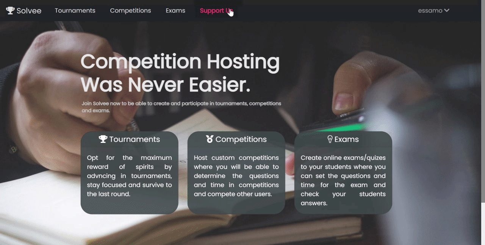
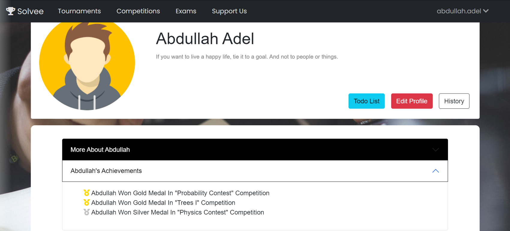
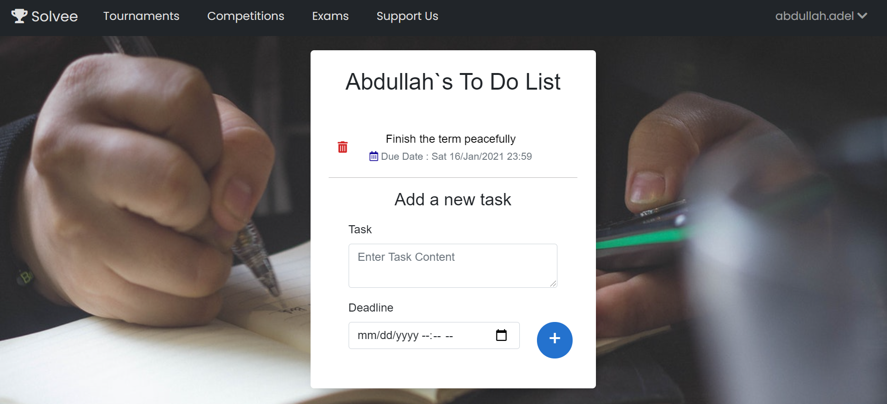

  
  # <h1>🏆 Solvee </h1>
**Solvee** is a competition and examination website which lets users either host or participate in custom competitions and exams.

---
### 🧐 About:
#
**Solvee** is a web-hosted examination and
competition portal, where users can register in order to host & create
competitions and exams that participants (other users) can join and
attempt to solve in a specified time limit.
The key differences between exams and competitions are that
competitions reward participants by ranking them higher in the
leaderboard based on both the time taken to finish competition and the
grade achieved within that time, the top participants in the leaderboard
are also subject to awards and achievements which will be added and
displayed on their accounts. Exams on the other hand are only
concerned with grades, and unlike competitions they allow users to
check for their mistakes.

---
### ⛏️ Built Using:
#
 
   

 
   

 
   

---

### 📷 Snippets:

  <h2> Homepage </h2> 
 

 
 
  <h2> Exams </h2> 
 

 
  
  <h2> Competitions </h2> 
 

 
  
  <h2> Tournaments </h2> 
 

 
   
  <h2> Support </h2> 
 

 
 
  <h2> Profile </h2>  

 
 
  <h2> To-do-list </h2> 

 
  <h2> And finally, Responsiveness </h2> 

<h1 align='center'> Thank You. </h1>

#

